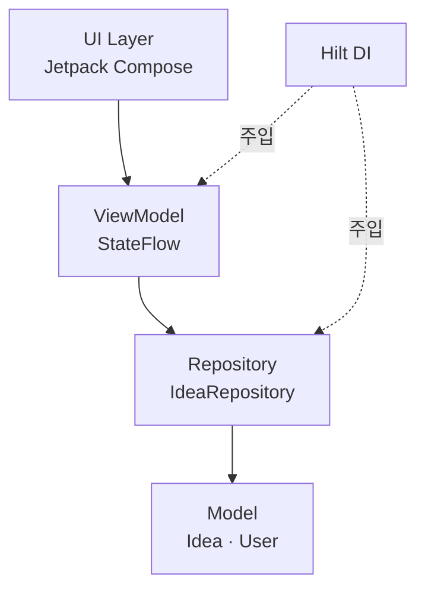

# 📱 iShare – 아이디어 공유 플랫폼(Kotlin Version)
> 💡 아이디어의 기록부터 공유, 검증, 거래까지 이어주는 창작자 플랫폼

> **🚧 개발 진행 상태**  
> 빠른 MVP 구현을 위해 Kotlin 기반 프로젝트를 React Native/Expo로 전환 중이며, Kotlin 버전은 현재 일시 중단된 상태입니다.

---

### 📌 프로젝트 개요

- **진행 기간**: 2025.01 ~ 현재 (리팩토링 진행 중)
- **역할**: 기획 100% / UIUX 설계 / Android 앱 개발
- **핵심 기술 스택**: Kotlin, Jetpack Compose, ViewModel, Hilt, StateFlow

---

### 🚀 주요 기능

#### ✅ 구현 완료
- 아이디어 등록 / 수정 / 삭제
- 댓글, 공감, 공유, 정렬
- 공개/비공개 설정, 카테고리 필터, 검색 기능

#### ⏳ 구현 예정
- AI 기반 창업 가능성 분석
- NDA 열람 제한 기능
- 회원가입 / 로그인

---

### 🛠 사용 기술

| 분야 | 기술 |
|------|------|
| 언어 | Kotlin |
| UI | Jetpack Compose |
| 아키텍처 | MVVM, ViewModel, StateFlow |
| 의존성 주입 | Hilt |
| 협업 도구 | Notion, Figma |
| 버전 관리 | Git, GitHub |

---

### 📁 프로젝트 구조

```bash
app/
├── data/           # Repository, 데이터 접근 계층
├── model/          # 데이터 모델 정의
├── ui/             # UI 컴포저블 및 화면
├── viewmodel/      # ViewModel 계층
├── util/           # 공통 유틸 함수들
└── di/             # Hilt 의존성 주입 설정
```
---

### 🏗️ 아키텍처 (MVVM)



---

### 🔄 현재 상태

> ✅ 핵심 기능 중심의 MVP 완성  
> 🛠 구조 리팩토링 및 상태 관리 개선 진행 중  
> 🔜 사용자 인증, AI 분석, NDA 기능 등 차후 개발 예정

---

### 🔍 사용 흐름 요약

- **Main 화면**: `Idea Share` (공개 아이디어 탐색) / `My Idea` (내 아이디어 관리)
- **IdeaListScreen**: 공개 아이디어 목록 / 댓글, 공감, 공유 가능
- **MyIdeaListScreen**: 내가 작성한 아이디어 목록 (공개/비공개)
- **Idea/MyIdeaDetailScreen**: 아이디어 상세 보기
    - 공개: 댓글, 공감, 공유 가능
    - 비공개: 공유 버튼만 노출
- **IdeaWriteScreen**: 아이디어 작성 (공개/비공개, 카테고리, 특허, 거래/NDA 설정)

> 👉 전체 흐름과 화면별 설명은 [Notion 포트폴리오](https://t.ly/5GUIV)에서 확인할 수 있어요!


---

### 🙋‍♂️ 기획 및 개발 의도

평소 아이디어를 상상하고 구상하는 것을 즐겼지만, 메모해두기만 하고 제대로 활용하지 못한 경험이 많았습니다.  
그러던 중,

> “누군가의 아이디어가 적절히 활용된다면 얼마나 좋을까?”

라는 질문이 떠올랐고, 이를 계기로  
**아이디어의 기록 → 보호 → 공유 → 검증 → 거래·창업·소통**까지  
자연스럽게 이어지는 플랫폼을 기획하게 되었습니다.

이 프로젝트는 단순한 기능 구현을 넘어서,  
**사용자 경험 중심의 흐름 설계와 서비스 구조 고민**이 담긴 결과물입니다.

- 사용자 입장에서 **핵심 기능만 담은 실전 MVP**를 설계했습니다.

- **비전공자로서 Kotlin과 Compose를 독학하며**, 전체 개발을 직접 구현했습니다.

- 단순 구현을 넘어, **서비스 흐름 설계와 UI/UX 개선까지 주도적으로 수행**한 프로젝트입니다.

---

### 💡 향후 계획

- Firebase 연동 및 실 사용자 테스트

- 아이디어 보호 기능(NDA 체크, 유료 열람 등)

- 창업 가능성 분석 AI 기능

---

### 📝 느낀점 & 회고

- 기획 → UI/UX 설계 → Android 개발까지 **모든 과정을 직접 경험**하며 서비스의 전체 흐름을 체감할 수 있었습니다.
- 특히 **카테고리/댓글/공유 기능을 포함한 상태 관리** 구현 과정에서 `ViewModel`과 `StateFlow`를 깊이 있게 다룰 수 있었고, 실제 사용자 입장에서의 UX 흐름을 고민하게 되었습니다.
- "기획은 사용자 입장에서 출발해야 한다"는 점을 다시 느꼈고, 단순히 기능을 만드는 것을 넘어서 **문제를 해결하는 서비스 설계의 중요성**을 체득할 수 있었습니다.
- 혼자서 만드는 프로젝트였지만, **팀 단위 협업을 대비해 모듈화, 재사용성, 유지보수성**을 고려한 설계를 하려고 노력했습니다.
- i-Share를 통해 제가 지향하는 기획자/PM의 역량 방향성을 명확히 다질 수 있었습니다.

---

### 📸 앱 화면 미리보기

<p align="center">
  
</p>
